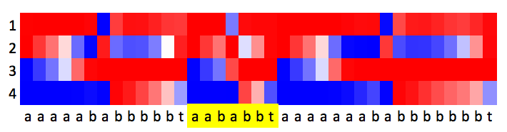

# RNN-mem
Andrej Karpathy (@karpathy) wrote a [blog post](http://karpathy.github.io/2015/05/21/rnn-effectiveness/) on [RNNs for character-by-character text generation](https://github.com/karpathy/char-rnn). Inspired by this, me, Uma Roy (@puma314), and Joe Zurier performed analysis on how RNNs learn to store information in their hidden state when trained on simple tasks.

We implemented a simple RNN (based off of Karpathy's [100-line implementation](https://gist.github.com/karpathy/d4dee566867f8291f086)) for use on three general classes of tasks. We found that when RNNs with very few hidden neurons were trained, the individual neurons learned to "specialize" in surprisingly human-understandable and natural ways--as bits, counters, flags, etc. The RNNs can be said to have learned to compress information from sequential data.

## Character Counting

For this class of tasks, an RNN was trained to either **1)** output lines consisting of a digit, followed by the appropriate number of occurrences of a special character (ex: `3ccc`, `6cccccc`) or **2)** output lines consisting of some number of characters, followed by the corresponding digit. In the first case, the RNN was able to learn the task to 90%+ accuracy with only two neurons--one acting as a flag, and another acting as a counter.

The code for this task is available in this repository. Simply run `experiment.py`; this trains a `Simple_RNN` whose weight matrix and neuron activations were used in analysis to make the figure below.

Neuron 1 is a flag which controls whether our not to output a delimiter and a number. The digit chosen affects how strongly neuron 2 activates. Neuron 2 acts as a counter, controlling how many special characters are printed following a digit. The above image demonstrates that, with this setup, printed sequences are almost always correct. On some trials, the 2-neuron trained RNN achieved accuracies over 90%.

## Grid Games

For these tasks, an RNN is trained to fill a grid (possibly according to certain constraints). Unless otherwise stated, the grid used is a 3 by 3 square of 9 cells.

| 0  | 1  | 2  |
| --- | --- | --- |
| **3** | **4** | **5** |
| **6** | **7** | **8** |

### Filling a Grid

First, we train an RNN to fill the cells of the grid in at random, and then to clear the board. At any given time, the RNN must remember what cells of the grid have already been filled in; it must also recognize when all cells have been filled in order to clear the board at the correct time. "Bad" moves include trying to fill in a cell that has already been filled, or clearing early.

With 10 neurons, the RNN learns to fill and clear boards perfectly. Below is a sample sequence of two board-filling operations. The number in the bottom row corresponds to the cell that is filled in that move; a move of "9" indicates that the board has been cleared.

Interestingly, note that neurons usually correspond directly to cell squares, acting as bits: for example, neuron 2 activates when cell 6 is filled, neuron 4 activates when cell 2 is filled, etc. Neuron 9 appears to track the overall progress of board filling, remembering whether or not the board is to be cleared. The correspondance is almost 1-to-1!

Another interesting observation is that 10 neurons appears to be close to the minimum number of neurons needed to fully retain the board state. This makes sense, since each neuron generally learns to track an individual cell. In the figures below, we compare the performance of a trained 5-neuron RNN, a trained 10-neuron RNN, and an "optimal" 10-neuron RNN. 

To assess at the performance of the RNNs, we observe the Softmax output probabilities for each subsequent output as we input a correct sequence. Below is a heatmap of these probabilites as we fill in the board from left to right, top to bottom. The row specifies the board state, which gets progressively more filled as we move down. The column specifies the output vector. Colored entries above the jagged line correspond to ``good'' outputs; i.e. nonzero probabilities for filling squares that have not already been filled. Colored entries below the jagged line correspond to ``bad'' outputs; i.e. nonzero probabilities for filling squares that are already full. The rightmost column corresponds to termination, and should be 0 until the board is full and 1 once it's full.

  

It is clear that the 10-neuron RNN vastly outperforms the 5-neuron RNN, doing a much better job of staying above the jagged line. Looking closer at the operation of the 5-neuron RNN, we found that the RNN was doing the best it could to take "shortcuts" in remembering the board--often using single neurons to remember whether or not multiple cells were filled.

Unfortunately, these nice correspondances don't always extend cleanly to larger grids. We experimented with grids of size 11 or more, and found that neurons often fail to specialize as perfectly as they did for grids up to size 9. Some neurons begin tracking multiple cells; others have no discernable meaning. This may also be a result of an insufficient training program. Despite this, the results for the 9-cell grid fill task are once again surprisingly understandable. 

### 3-in-a-row

In the slightly more complex 3-in-a-row task, we added the condition that the RNN must clear the board once three counters are placed in a row (along some row, column or diagonal--reminiscent of tic-tac-toe). An RNN with a hidden state of size 30 learns to do this task perfectly. Once again, we found interesting correspondances between cells and certain neurons, as well as rows and certain neurons. Consider the four neurons shown below.

Neurons 3 and 18 appear to have no easily-understandable function. Neuron 4 appears to track the fourth position on the board. However, neuron 9 appears to track something more interesting--whether or not the top row of the grid is filled. On boards where the 0-1-2 row is filled first, neuron 9 activates a turn *early* (see upper figure)). Additionally, we know that neuron 9 is specifically tracking this row because of its behavior in cases where the board is cleared due to rows other than the top row being filled. For example, the lower figure shows that neuron 9 does not delay this early-activation behavior in sequences of moves where the 6-7-8 row is the first row to be filled.

## Simple Grammars

Finally, we considered the task of learning strings generated by rules of a simple grammar. Consider the following two rules:

*S &rarr; aSb*

*S &rarr; ba*

The set of strings generated by these rules is equivalent to the set of strings of the form *anbabn*. We train an RNNs with 3 and 4 neurons to generate strings of this form, character-by-character. As the number of neurons decreases, the RNN makes choices on what information it prioritizes remembering (sometimes redundantly), minimizing the accuracy loss--with 4 neurons, the RNN produces perfect strings in the language, but the 3 neuron RNN is sometimes off by one or more characters. 

In the 3-neuron case, neuron 1 acts as a counter for the second half of the sequence, neuron 2 acts as a counter for the first half, and neuron 3 handles the special character switch in the middle of the string. The RNN has decided that these are the three most important pieces of information about sequences of this type; it has ended up choosing features very similar to those that a human would pick out when trying to discover the pattern in these sequences. Constraining the memory of this RNN forces it to compress information about relevant sequences.

In the 4-neuron case, neuron 1 handles the middle switch. Neurons 2 and 3 act as counters in the first half; neurons 2 and 4 act as counters in the second half. Evidently, this level of redundancy is helpful in achieving perfect performance. 
